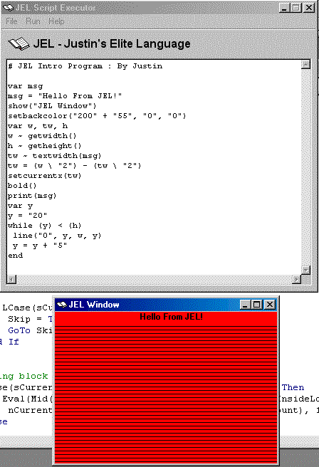



## JEL \- A Scripting Language

### Description

JEL is a scripting language made in VB that can make into an EXE file. JEL is powerful, small, and fast. It can use variables, equations, functions, if's, loops, goto's, etc. Not convinced yet? Look at the screenshot, that's not even half of what it can do! The language can also be easilly modified to include more functionality.

I made this because I am a veteran at making scripting languages and I saw D++ getting all the kudos. This took me 2 days of non stop work and hard thinking about parsing the code but i did it. If you like this code please vote for it! (also visit my site, www.oogle.net)

note: This code uses the split() function which is in vb6 only. you can find it's equivilency somewhere on this site.
 
### More Info
 

             |
---                |---
**Submitted On**   |2000-08-18 15:30:10
**By**             |[Justin Tunney](https://github.com/Planet-Source-Code/PSCIndex/blob/master/ByAuthor/justin-tunney.md)
**Level**          |Advanced
**User Rating**    |4.2 (127 globes from 30 users)
**Compatibility**  |VB 6\.0
**Category**       |[Complete Applications](https://github.com/Planet-Source-Code/PSCIndex/blob/master/ByCategory/complete-applications__1-27.md)
**World**          |[Visual Basic](https://github.com/Planet-Source-Code/PSCIndex/blob/master/ByWorld/visual-basic.md)
**Archive File**   |[CODE\_UPLOAD90908182000\.zip](https://github.com/Planet-Source-Code/justin-tunney-jel-a-scripting-language__1-10796/archive/master.zip)

